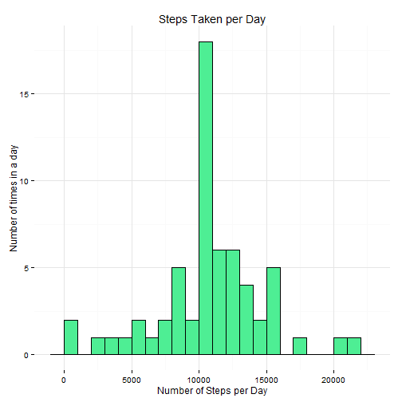

Reproducible Research: Peer Assessment 1
==================================

###Load required libraries

```r
library(data.table)
library(ggplot2)
```

###Loading and preprocessing the data


```r
df.activity<-read.csv(unz("Activity_Monitoring_Data.zip","activity.csv"),header=TRUE,sep=",",
                      colClasses=c("numeric","character","numeric"))

df.activity$date<-as.Date(df.activity$date, "%Y-%m-%d")
df.activity$interval<-as.factor(df.activity$interval)
head(df.activity)
```

```
##   steps       date interval
## 1    NA 2012-10-01        0
## 2    NA 2012-10-01        5
## 3    NA 2012-10-01       10
## 4    NA 2012-10-01       15
## 5    NA 2012-10-01       20
## 6    NA 2012-10-01       25
```

###What is mean total number of steps taken per day?

We proceed by calculating the total steps per day.

```r
steps_per_day<-aggregate(steps~date,df.activity,sum)
colnames(steps_per_day)<-c("date","steps")
head(steps_per_day)
```

```
##         date steps
## 1 2012-10-02   126
## 2 2012-10-03 11352
## 3 2012-10-04 12116
## 4 2012-10-05 13294
## 5 2012-10-06 15420
## 6 2012-10-07 11015
```

Now we make a histogram of the total number of steps taken per day

```r
ggplot(steps_per_day, aes(x=steps)) +
  geom_histogram(colour="black", fill="deepskyblue1", binwidth=1000) +
  labs(title="Steps Taken per Day", 
       x="Number of Steps per day",
       y="Number of times in a day") +
  theme_minimal()
```

 

Now we calculate the **mean** and **median** of the number of steps taken per day.

```r
steps_mean<-mean(steps_per_day$steps, na.rm=TRUE)
steps_median<-median(steps_per_day$steps, na.rm=TRUE)
```
**Mean** = 10766.19  
**Median** = 10765

###What is the average daily activity pattern?

We calculate the aggregation of steps by intervals of 5-minutes and convert the intervals into integers

```r
steps_per_interval<-aggregate(df.activity$steps, by=list(interval=df.activity$interval), FUN=mean, na.rm=TRUE)
steps_per_interval$interval<-as.integer(levels(steps_per_interval$interval)[steps_per_interval$interval])
colnames(steps_per_interval)<-c("interval","steps")
```

We make the plot with the time series of the average number of steps taken versus the 5 minute intervals

```r
ggplot(steps_per_interval, aes(x=interval, y=steps)) +
  geom_line(colour="violetred2", size=1) +
  labs(title="Average Daily Activity Pattern", x="Interval", y="Number of steps") +
  theme_minimal()
```

 

Now we find the 5-minute interval containing the maximum number of steps

```r
max<-steps_per_interval[which.max(steps_per_interval$steps),]
```
The **835th** interval has a maximum of 206 steps.

###Imputing missings values

The total number of missing values in steps can be calculated using is.na() method

```r
missing<-sum(is.na(df.activity$steps))
```
The total number of missing values is **2304**

To populate missing values, we can replace them with the mean value at the same interval across days.  

We create a function na_impute(data, per_value) where the data arguement is the df.activity dataframe and per_value
is the steps_per_interval dataframe.

```r
na_impute<-function(data, per_value) {
  na_index<-which(is.na(data$steps))
  na_replace<-unlist(lapply(na_index, FUN=function(idx) {
    interval<-data[idx,]$interval
    per_value[per_value$interval == interval,]$steps
  }))
  impute_steps<-data$steps
  impute_steps[na_index]<-na_replace
  impute_steps
}

df.activity_impute<-data.frame(
  steps<-na_impute(df.activity, steps_per_interval),
  date<-df.activity$date,
  interval<-df.activity$interval)
str(df.activity_impute)
```

```
## 'data.frame':	17568 obs. of  3 variables:
##  $ steps....na_impute.df.activity..steps_per_interval.: num  1.717 0.3396 0.1321 0.1509 0.0755 ...
##  $ date....df.activity.date                           : Date, format: "2012-10-01" "2012-10-01" ...
##  $ interval....df.activity.interval                   : Factor w/ 288 levels "0","5","10","15",..: 1 2 3 4 5 6 7 8 9 10 ...
```

We check that there now no missing values

```r
sum(is.na(df.activity_impute$steps))
```

```
## [1] 0
```

Now we will plot a histogram of the daily total number of steps taken after filling missing values

```r
imputed_steps_per_day<-aggregate(steps~date, df.activity_impute, sum)
colnames(imputed_steps_per_day)<-c("date","steps")

ggplot(imputed_steps_per_day, aes(x=steps)) +
  geom_histogram(colour="black", fill="seagreen2", binwidth=1000) +
  labs(title="Steps Taken per Day", x="Number of Steps per Day", y="Number of times in a day") +
  theme_minimal()
```

 

Now we report the **mean** and **median** number of steps taken per day

```r
steps_mean_imputed<-mean(imputed_steps_per_day$steps, na.rm=TRUE)
steps_median_imputed<-median(imputed_steps_per_day$steps, na.rm=TRUE)
```
**Mean** = 10766.19   
**Median** = 10766.19

The median is slightly different from the first part of the assignment. Now, the mean and median number of steps taken per day are equal after imputing data.

###Are there differences in activity patterns between weekdays and weekends?

We will do this comparison using the table with imputed values  
1. Augment the table with a column that inducates the day of the week  
2. Subset the table into two parts - weekends and weekdays  
3. Tabulate the average steps per interval for each data set  
4. Plot the two data sets side-by-side for comparison

```r
weekdays_steps <- function(data) {
    weekdays_steps <- aggregate(data$steps, by=list(interval = data$interval),
                          FUN=mean, na.rm=T)
    # convert to integers for plotting
    weekdays_steps$interval <- 
            as.integer(levels(weekdays_steps$interval)[weekdays_steps$interval])
    colnames(weekdays_steps) <- c("interval", "steps")
    weekdays_steps
}

data_by_weekdays<-function(data) {
    data$weekday<-as.factor(weekdays(data$date))
    weekend_data<-subset(data, weekday %in% c("Saturday","Sunday"))
    weekday_data<-subset(data, !weekday %in% c("Saturday","Sunday"))

    weekend_steps<-weekdays_steps(weekend_data)
    weekday_steps<-weekdays_steps(weekday_data)

    weekend_steps$dayofweek<-rep("weekend", nrow(weekend_steps))
    weekday_steps$dayofweek<-rep("weekday", nrow(weekday_steps))

    data_by_weekdays<-rbind(weekend_steps, weekday_steps)
    data_by_weekdays$dayofweek<-as.factor(data_by_weekdays$dayofweek)
    data_by_weekdays
}

data_weekdays<-data_by_weekdays(df.activity_impute)

ggplot(data_weekdays, aes(x=interval, y=steps)) +
  geom_line(colour="darkorchid4") +
  facet_wrap(~dayofweek, nrow=2, ncol=1) +
  labs(x="Interval", y="Number of steps") +
  theme_minimal()
```

 

We can see at the graph above that activity on the weekday has the greatest peak from all steps intervals. But, we can see too that weekends activities has more peaks over a hundred than weekday.


